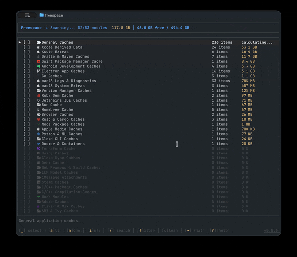

# Freespace

Your disk fills up with caches, build artifacts, and leftovers from dozens of dev tools. Each has its own cleanup dance. Freespace gives you a single TUI to reclaim that space — powered by community-written cleanup modules.



## Install

### With [Homebrew](https://brew.sh)

```sh
brew install nicorichard/tap/freespace
```

### With [mise](https://mise.jdx.dev)

```sh
mise use -g github:nicorichard/freespace@latest
```

### From source

```sh
cargo build --release
# Binary at target/release/freespace
```

## Why Freespace

**Complete out of the box** — Ships knowing about 50+ tools: Docker, Xcode, npm, Homebrew, Gradle, Steam, and the rest. No install step.

**Declarative & safe** — Modules are plain TOML manifests. A manifest declares paths, or names one of freespace's built-in handlers; it can never specify a command of its own. You can read and audit every module in seconds.

**Correct, not just thorough** — Some things break if you just delete their directory. Simulator devices and runtimes are removed through `xcrun simctl`, which keeps CoreSimulator's registry consistent, and freespace shows you the exact command before it runs anything.

**Extensible** — Add your own TOML module for paths freespace doesn't know about, install one from any Git repo, or override a built-in by shipping a module with the same id.

## What a module looks like

A module is a `module.toml` that describes what to scan and clean. Here's a real one:

```toml
name = "Xcode Derived Data"
version = "1.0.0"
description = "Xcode build artifacts and derived data. Safe to delete; Xcode regenerates on next build."
author = "freespace"
platforms = ["macos"]

[[targets]]
path = "~/Library/Developer/Xcode/DerivedData/*"
description = "Xcode derived data directories for each project"
```

That's it. No scripts, no plugins — just a declaration of where disk space hides.

## Heads up

Freespace deletes files. We require confirmation before any cleanup, but please review what you're removing and keep backups of anything important. Use at your own risk — see the MIT license for details.

## Configuration

Freespace can be configured via `~/.config/freespace/config.toml`. See the [configuration docs](docs/configuration.md) for all available options.

## Community Modules

Install a module from GitHub:

```sh
freespace module install github:owner/repo
```

### Create your own

1. Create a directory with a `module.toml`
2. Define your targets — paths or directory patterns to scan
3. Push to GitHub
4. Anyone can install it with `freespace module install github:you/your-module`

See the example module above for the manifest format.

## License

MIT
